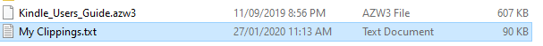

# kindle-citation-extractor

A simple tool to extract data from Kindle "clipping" files.



This library will parse the bespoke format for Kindle clippings and translate it into an array of objects:

```javascript
const clippings = fs.readFileSync('My Clippings.txt', 'utf-8');
const data = parser(clippings);
console.log(clippings);
```

The following properties are supported:

```
{ 
    book: 'The Passage of Power',
    author: 'Robert A. Caro',
    quote:
        'And one of the key elements in Lyndon Johnson’s command of his world — the Senate world — was his decisiveness.',
    page: 'page 52',
    location: 'Location 784-785',
    dateAdded: 2016-03-21T12:21:24.000Z 
},
```

## Notes

- Clipping files are expected to use UNIX line endings (`\n`). To convert a clippings file to unix line endings on Windows, simply run the following command: `dos2unix clippings.txt`.
- Since Kindle clipping files do not contain timezones for dates, all dates are assumed to be in the local timezone.